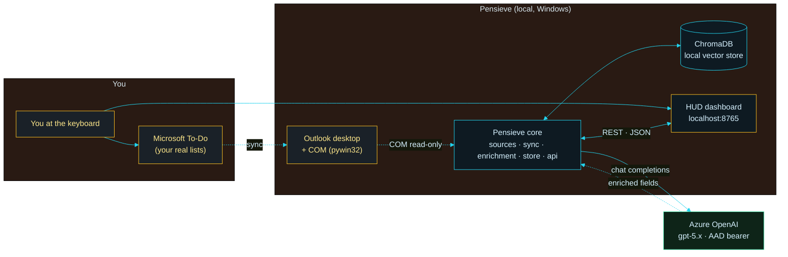
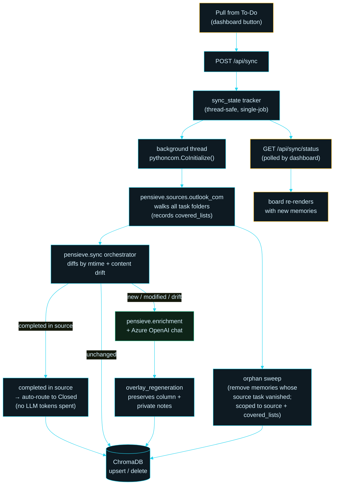
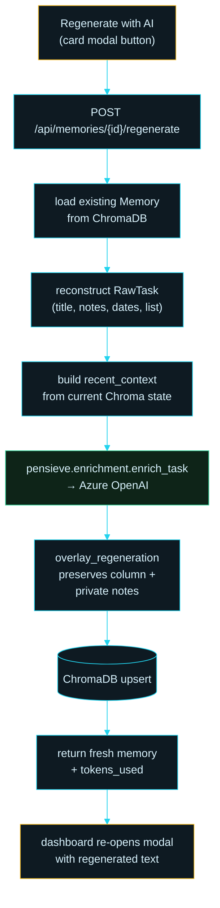

# Pensieve

> *Stir the surface and look within.*

Pensieve is a local, single-user productivity tool that pulls your Microsoft To-Do tasks, enriches each one with an LLM, stores them in a local vector database, and lays them out on a HUD-style kanban dashboard organized around your annual goals.

It runs entirely on your machine. Your To-Do data is read-only. Your enrichments live in a local ChromaDB. The dashboard is a static page served from a local FastAPI server.

> 🚀 **New here? See [SETUP.md](SETUP.md) for a 10-minute install + first-sync walkthrough.**

---

## Table of contents

1. [Why this exists](#why-this-exists)
2. [What it does](#what-it-does)
3. [Core concepts](#core-concepts)
4. [Connect Goals and lanes](#connect-goals-and-lanes)
5. [Phased roadmap](#phased-roadmap)
6. [Cross-PC mirror mode (optional)](#cross-pc-mirror-mode-optional)
7. [Auto-sync and close writeback (optional)](#auto-sync-and-close-writeback-optional)
8. [Architecture](#architecture)
9. [Quickstart](#quickstart)
10. [The dashboard](#the-dashboard)
11. [Configuration](#configuration)
12. [Repository layout](#repository-layout)
13. [Hard constraints](#hard-constraints)
14. [Current status](#current-status)
15. [Design notes](#design-notes)
16. [License and acknowledgements](#license-and-acknowledgements)

---

## Why this exists

Microsoft To-Do is good at capturing tasks. It is not good at telling you:

- which of those tasks actually move the needle on your annual goals
- which ones share a thread (the same strand of work) and could be batched
- which ones are low-impact admin you should just power through
- what the past six weeks of your work has actually been about
- which finished tasks deserve to be remembered as evidence of impact

Pensieve sits next to To-Do, reads your tasks, and answers those questions. It does not change your To-Do. It enriches a parallel local store you can explore, search, and reflect against.

The mental model is from the books: a Pensieve is a basin where you store and revisit memories. Captured tasks become Memories. Memories you take depth on become Dives. Work that needs another look gets pulled into Review. Closed work that taught you something is kept as evidence (Phase 3 will distill it into "Vials" for performance reviews).

## What it does

In its current state, Pensieve:

- **Pulls** every task from your default Outlook tasks folder (To-Do tasks are Outlook tasks under the hood), read-only, via local COM interop on Windows. No Microsoft Graph, no Entra app, no admin consent.
- **Enriches** each task with an Azure OpenAI call that asks: which Strand is this part of, what is its real why and impact, which of your annual Connect Goals does it serve, and how confident are we about each of those?
- **Stores** the enriched result in a local ChromaDB. Each task gets an embedding so you can semantically search the whole corpus.
- **Serves** a local FastAPI on `http://localhost:8765` that exposes the enrichments and powers the dashboard.
- **Renders** a single dark HUD-style kanban dashboard with two views (Lifecycle and Lanes), a drag-and-drop column model, semantic search, and an in-app editor for your Connect Goals.

What it deliberately does **not** do (yet):

- Touch your calendar, mail, Teams, or any other Microsoft Graph surface
- Run anywhere except your machine
- Require any custom Entra app registration

It can optionally mirror your kanban column back to To-Do as a single
`pensieve/col:<col>` tag on the source task, and (separately) mirror a
drag-to-Closed by marking the source task complete via `MarkComplete()`.
Both surfaces are namespace-scoped, reversible, and off by default. See
[Cross-PC mirror mode](#cross-pc-mirror-mode-optional) and
[Auto-sync and close writeback](#auto-sync-and-close-writeback-optional)
below.

## Core concepts

| Concept | What it is | Where it lives |
| ------- | ---------- | -------------- |
| **Task** | A row from Microsoft To-Do (Outlook task), pulled read-only | Outlook, mirrored into Pensieve only as input |
| **Strand** | A named recurring thread of work (DORA RFI Responses, NIS2 Crosswalk, 1:1 Prep, etc.). Each Strand has a `kind` (deep, tactical, learning, writing) and may map to one or more Connect Goals. | `data/samples.json` `strand_catalog` (you maintain it) |
| **Memory** | An enriched task. Has a Strand assignment, a `why`, an `impact`, confidence scores, and one or more Connect Goal alignments. Stored as a row in ChromaDB with title-and-body embeddings. | `data/chroma/` |
| **Lifecycle column** | Where a Memory sits in your workflow: Memory → Dive → Review → Closed. You drag cards between columns; your placement survives re-syncs. | Dashboard state, persisted via API |
| **Dive** | A Memory you decided to take depth on this week |
| **Review** | A Memory you want a second look at — manually flagged for follow-up (this is user-driven; the "needs review" badge that the LLM raises is independent and can appear in any column) |
| **Closed** | A Memory that is done. Tasks completed in To-Do auto-route here on the next sync. |
| **Connect Goal** | One of your annual top-level goals. Pensieve maps each Memory to zero, one, or several. Count is up to you — import your Connect PDF and any number of goals works. | `data/connect-goals.json` |
| **Lane** | A color slot each Connect Goal is mapped to (purely a visual identity for the Lanes view). 8 lane slots available; goals beyond 8 cycle. The slug names that live in `connect-goals.json` and the CSS are legacy from an earlier visual identity and are preserved as stable color-mapping keys. | Set inside each goal's record |

Future-stage concepts still in the codebase but not exposed as columns today:

- **Reverie** — a scheduled focus block (Phase 2.5). The proposal and debrief prompts are pre-staged in `prompts/`; calendar integration is deferred.
- **Vial** — a single closed task's distilled impact statement, exported to Synapse Promo Coach (Phase 3). The Pydantic model exists; the export pipeline does not yet.

## Connect Goals and lanes

Connect Goals are the annual top-level goals you set with your manager (the Microsoft Connect process is the inspiration; the concept works with any annual goal framework — OKRs, V2MOM, MBOs).

Pensieve treats them as first-class. Every Memory gets aligned (or explicitly not aligned) to one or more Connect Goals during enrichment, with a confidence score and a short alignment note explaining the reasoning.

The dashboard supports two views:

- **Lifecycle view**: 4 columns (Memory → Dive → Review → Closed), the classic kanban
- **Lanes view**: one column per Connect Goal, color-coded by lane, plus an "Unaligned" column for work that doesn't directly map to any annual goal. Columns auto-fit, so any number of goals lays out cleanly.

You can populate your goals in three ways:

1. **Upload your Connect PDF** (recommended). Click **Set Goals** in the dashboard, choose your Connect PDF, click ✨ Parse with AI. The backend extracts each goal and deterministically assigns a lane from an 8-entry color palette.
2. **Hand-edit** them with the in-modal editor (+ Add goal / × delete on each card).
3. **Edit `data/connect-goals.json`** directly if you prefer your text editor.

All three paths persist to the same file via `POST /api/goals`. The dashboard hydrates from `GET /api/goals` on load.

The 8 lane slots are intentional but cosmetic:

| Lane slug | Palette | Best fit for goals that are |
| --------- | ------- | --------------------------- |
| `crimson` | Scarlet and gold | Front-line, high-visibility work |
| `gold` | Yellow and black | Sustained, year-over-year, dependable delivery |
| `emerald` | Green and silver | Long-game strategic foundation, careful positioning |
| `azure` | Blue and bronze | Innovation, learning, intellectual depth |
| `slate` | Slate and gold | Internal-team-facing operational work |
| `ember` | Terracotta and parchment | Cross-organization coordination |
| `sage` | Forest and gold | Long-arc strategic foresight and judgment work |
| `rose` | Ember and saffron | High-stakes recovery or transformation work |

The slug names are stable color-mapping keys (`data-lane` in the DOM, the `LANE_PALETTE` constant in code, the `lane` field in `connect-goals.json`). Goals beyond eight cycle through the palette again. You can rename or recolor any lane in `pensieve/enrichment/goals_importer.py::LANE_PALETTE` and the mirror in `frontend-proto/pensieve.js`.

## Phased roadmap

Pensieve is built in deliberate phases. Each phase has a clear ship gate and is meant to be useful on its own.

**Phase 0 — Sample-driven enrichment** *(complete)*
Read tasks from a canned `samples.json`, run them through the enrichment prompt, prove the prompt does sensible work. PowerShell, no Chroma, no API.

**Phase 1 — Local stack with ChromaDB and live To-Do** *(current)*
Read live To-Do tasks via Outlook COM (read-only), enrich them, persist to local ChromaDB, serve via FastAPI, render on the dashboard. No writeback, no calendar, no Graph.

**Phase 2 — Closure capture and Vials** *(v1 MVP shipped)*
When a task lands in the Closed column, the card grows an amber **&#x1F4DC; CAPTURE** chevron prompting you for one sentence about what changed. Pensieve stores that as a Vial: a durable, snapshot-backed promo evidence record that **outlives the source task** (even if you later delete it from To-Do). v1 MVP is user-typed; v1.1 will add an optional AI-polish pass that drafts an IC-framed statement from your sentence. See the dashboard section below for usage, and `brainstorms/01-review-findings.md` for the full Vial v1 design.

**Phase 2.6 — Garden: board tending game** *(v1 + v2 + v3 shipped)*
A quiet HUD-style gamification of board hygiene. Every deliberate action on a card — drag, edit, capture/skip a Vial, regenerate — bumps its `last_tended_at` timestamp. Cards age through **fresh → active → stale → ghost** based on how long they've gone untouched (3 / 8 / 30 day thresholds), shown as a small colored dot on each card. The masthead grows a **HEALTH 00–100** pill that scores the whole board (penalties for stale/ghost/overdue cards, bonus for captured Vials on closed cards). Click the pill to filter the board to offenders. Auto-sync from To-Do does **NOT** count as tending — only your deliberate actions do, so the freshness signal stays real. v2 adds **daily quests** (up to 3 per day, e.g. "Tend the 3 stale cards in CISO GRC") with click-to-filter chips, a `🔥 N-day clean streak` counter, and a **+5 board-health bonus when all today's quests are complete**. v3 adds **9 achievement badges** (🌱 Sprout, 📜 Scribe, 🌟 Centurion, 🧹 Custodian, ⚡ Storm, 🏆 Clean Week, 🔥 Streak Keeper, 🎯 Sharpshooter, 🌳 Gardener) accessible via the 🏆 button beside the HEALTH pill — fires a confetti micro-burst on new unlocks — plus a `/api/garden/level-summary` endpoint for the Friday digest to consume. See `brainstorms/02-board-tending-game.md` for the full design and GitHub issues #6/#7/#8.

**Phase 3 — Reflection and Reverie debrief**
Weekly and monthly reflection prompts. Closing-of-Reverie debrief flow. Reflection turns into structured notes you can paste into a manager update or a self-assessment without losing the original framing.

**Phase 4 — Calendar integration**
Pensieve proposes focus blocks for Reverie based on your stated weekly deep-work budget, then writes them to your calendar after you approve. This phase is deferred until corporate calendar integration paths under SFI are clearer.

**Phase 5 — Cross-source sync**
Pull tasks from multiple sources at once (To-Do, GitHub issues you own, action items extracted from meeting notes, etc.). Same Chroma, same dashboard, same Connect Goal alignment.

**Phase 6 — Multi-machine sync**
A small sync layer so your Chroma store is consistent across machines without losing the "local first, no cloud needed" property. Until then, the much lighter [mirror mode](#cross-pc-mirror-mode-optional) below keeps the kanban view consistent across PCs.

## Cross-PC mirror mode (optional)

If you run Pensieve on more than one PC against the same Microsoft To-Do account, you can have your kanban column travel with the task itself. When mirror mode is on:

- Every time you drag a card to a new column, Pensieve writes a single tag to that task's Outlook Categories field: `pensieve/col:<column>` (e.g. `pensieve/col:dive`).
- On the next sync from your other PC, Pensieve reads that tag and lands the card in the matching column.
- Conflict policy: source-wins-on-newer. If you drag the same card on both PCs around the same time, the one whose Outlook write has the newer `LastModificationTime` wins.
- Completion is still terminal: if the task is marked complete in To-Do, it lands in Closed regardless of the mirror tag.

### Quickstart for a second PC

1. **Install Pensieve on PC-B** the normal way (clone, `pip install -e .[outlook]`, sign in to the same Outlook desktop account, run `pensieve sync --source outlook_com` once so PC-B has its own Chroma store seeded).
2. **On *both* PCs**, add these two lines to `.env` and restart `pensieve.cli serve`:
   ```
   PENSIEVE_MIRROR_TO_SOURCE=true
   PENSIEVE_MIRROR_TAG_PREFIX=pensieve/col:
   ```
3. **Drag a card on PC-A.** Pensieve writes `pensieve/col:<col>` to that task's Categories field in Outlook (you can verify this in the Outlook desktop UI: open the task, look at the Categories field at the bottom).
4. **On PC-B**, run `pensieve sync --source outlook_com` (or trigger a sync from the dashboard). The card lands in the column the tag specifies.

The first cross-PC round-trip is the only one that needs Andy-in-the-loop verification. From then on it's silent.

### What you'll see in Outlook

The tag shows up as a plain Outlook category named `pensieve/col:memory` (or `dive` / `review` / `closed`). It's human-readable so you can debug the round-trip just by looking at a task in Outlook. The category color defaults to whatever Outlook assigns to a new category; if the visual noise bothers you, set its color to "no color" in Outlook once and Pensieve won't touch the color again.

### Turning it off cleanly

To stop mirroring without leaving traces in Outlook:

1. Set `PENSIEVE_MIRROR_TO_SOURCE=false` in `.env` on both PCs and restart.
2. Optionally, remove the `pensieve/col:*` categories from any tasks you've already touched. You can do that in Outlook by hand, or programmatically by calling `OutlookCOMSink.clear_column_tag(task_id, prefix="pensieve/col:")` for each task.
3. After the cleanup, the source tasks are exactly as they were before Pensieve ever touched them. User-authored categories were never modified.

### Troubleshooting

| Symptom | Likely cause | Fix |
| --- | --- | --- |
| PC-B sync runs but the card stays in the wrong column | The mirror tag was written but PC-B's sync ran before Outlook on PC-B finished its cloud pull | Wait ~30s for Outlook to pull from Exchange, then re-run `pensieve sync` |
| `mirror.reason` in the PATCH response is something other than `ok` | Outlook desktop is closed on the PC that's writing, or the task ID is stale | Open Outlook on the writing PC and re-trigger the drag |
| Both PCs disagree on the column after simultaneous drags | Source-wins-on-newer kicked in; the loser is the older drag | Either accept the winner or drag again on whichever PC should hold the final state |
| Mirror tag in Outlook but PC-B never lands the card there | `PENSIEVE_MIRROR_TO_SOURCE` not set on PC-B (the setting is symmetric — it controls reads too on a fresh memory) | Set it on PC-B and re-sync |

### Privacy / visibility note

The `pensieve/col:<col>` tag lives in the task's Outlook Categories field, which is **visible to anyone the task is shared with** (delegates, shared mailboxes, etc.). The tag only reveals your private kanban column for that task; it doesn't leak any of the enrichment (`why`, `impact`, Strand assignment, Connect-Goal alignment) — that all stays in your local ChromaDB. If you don't want even the column visible upstream, leave mirror mode off and use Phase 6 multi-machine sync (planned) instead.

### Where it lives in the code

- Writer: `pensieve/sources/outlook_com_sink.py` (only module under `pensieve.sources` that calls `.Save()`)
- Read-side hooks: `pensieve/sync.py::_column_from_task`, `_build_memory`, and `overlay_regeneration`
- API surface: `patch_column` and `patch_memory` in `pensieve/api/server.py` now return a `mirror: {mirrored, reason}` field on every response
- Settings: `pensieve/config.py` (`mirror_to_source`, `mirror_tag_prefix`)
- Tests: `tests/test_outlook_com_sink.py` + `tests/test_sync_mirror_tag.py` + `tests/test_scheduler.py` (117 tests, no live Outlook required)

The writer is isolated from the read-only `OutlookCOMSource` so the "sources are read-only" invariant in [AGENTS.md](./AGENTS.md) stays intact.

## Auto-sync and close writeback (optional)

Two separate opt-in surfaces that together make Pensieve feel "live" instead of a thing you have to remember to refresh. Both are off by default; both share the same single-writer lock as the manual **Pull from To-Do** button so they can never collide with a click-driven sync.

### Auto-sync scheduler

When the FastAPI app starts, it spins up a background `AutoSyncScheduler` that fires on a fixed interval and runs the same code path as `POST /api/sync`. The dashboard's frontend poll (every 30 s) picks up new enrichments shortly after.

| Setting | Default | What it does |
| --- | --- | --- |
| `PENSIEVE_AUTO_SYNC_INTERVAL_SECONDS` | `120` | Tick frequency. `0` disables the scheduler entirely. |
| `PENSIEVE_AUTO_SYNC_SOURCE` | (empty) | Source the scheduler should pull from. Empty falls through to `PENSIEVE_DEFAULT_SOURCE`. **If your default source is `sample_file` for fast CLI work, set this to `outlook_com` or scheduler ticks will silently skip themselves.** |

On startup you'll see one of two banners in the console:

```
Auto-sync scheduler started: every 120s from source 'outlook_com'.
```

or, if the resolved source is `sample_file` (re-syncing a static fixture every two minutes is pointless, so ticks no-op):

```
Auto-sync scheduler is enabled but the resolved source is 'sample_file',
so ticks will be no-ops. Set PENSIEVE_AUTO_SYNC_SOURCE=outlook_com (or
change PENSIEVE_DEFAULT_SOURCE) to actually pull from Outlook every 120s.
```

The scheduler shares one atomic lock with the manual `/api/sync` route, so a click during a tick and a tick during a click are both handled cleanly: whichever ran first owns the run, the other returns `already_running=true`.

### Close writeback (drag-to-Closed → MarkComplete)

When `PENSIEVE_MIRROR_COMPLETION=true`, dragging a card to the **Closed** column also calls `TaskItem.MarkComplete()` on the source Outlook task. That sets `Status`, `PercentComplete=100`, `DateCompleted=now`, and `Complete=True` consistently. Falls back to `item.Complete = True` for non-Task COM surfaces (e.g. a MailItem flagged as a task).

**v1 is one-way close-only by design.** Dragging a card **out** of the Closed column does **not** reopen the source task. The rationale: an accidental drag from Closed must not silently un-complete a task that may be shared with delegates. If you want to reopen a task, do it in Outlook directly. The next auto-sync moves the card back to **Memory** via the existing completion-drift handler in `pensieve.sync`.

The flag is intentionally separate from `PENSIEVE_MIRROR_TO_SOURCE` because completion is a much higher-impact write than a category tag (visible to delegates, propagates to shared lists, harder to undo). You can run the column-tag mirror on and the close writeback off, or vice versa.

A toast appears on the dashboard after a drag-to-Closed:

- `Marked complete in To-Do` — writeback succeeded
- `Closed locally but To-Do writeback failed: <reason>` — sink raised an error; the local column move is already persisted
- `Closed locally - upstream task not found in To-Do` — source `EntryID` was stale (task deleted upstream); next sync will reconcile

### Recommended setup for the live experience

```
PENSIEVE_AUTO_SYNC_INTERVAL_SECONDS=120
PENSIEVE_AUTO_SYNC_SOURCE=outlook_com
PENSIEVE_MIRROR_TO_SOURCE=true
PENSIEVE_MIRROR_COMPLETION=true
```

With those four set, the kanban auto-refreshes both ways: edits in Outlook show up in Pensieve within ~150 s worst-case, and drags in Pensieve write straight back to the source task.

### Where it lives in the code

- Scheduler: `pensieve/scheduler.py` (`AutoSyncScheduler` + `start_sync_job` helper, both used by `POST /api/sync` and the lifespan loop)
- Atomic lock: `pensieve/sync_state.py::SyncJobTracker.try_begin`
- Completion writer: `pensieve/sources/outlook_com_sink.py::set_completion` (uses `MarkComplete()` with `item.Complete = True` fallback; per-call `CoInitialize/CoUninitialize` bracket so it works on any FastAPI worker thread)
- API wire-up: `_mirror_completion_to_source` in `pensieve/api/server.py` (only fires when the target column is `closed`)
- Frontend poll: `refreshMemoriesIfSafe` in `frontend-proto/pensieve.js` (skips when a modal is open, a drag is in flight, a PATCH is in flight, or the tab is hidden)
- Tests: `tests/test_scheduler.py` (8 tests: atomic gate under a 10-way concurrent race, periodic firing, sample_file silent-skip, `auto_sync_source` override, clean stop) + completion-mirror cases in `tests/test_outlook_com_sink.py`

## Architecture

Pensieve's architecture is presented in three layered diagrams — a high-level **Context** view, plus two **Flow** views for the two main workflows. Each is small enough to fit in any LLM's output cap (under ~1,500 chars) and renders natively on GitHub.

### 1 / Context — what talks to what



**Read it as:** you live in two places (Microsoft To-Do for capturing, the Pensieve dashboard for thinking). Pensieve only reads from To-Do (via Outlook COM), enriches with Azure OpenAI, and persists everything in a local ChromaDB. The dashboard never writes to To-Do.

### 2 / Sync flow — Pull from To-Do



**Key invariants on this path:**

- **Outlook is read-only.** No `.Save()` anywhere; a unit test asserts forbidden mutation method names don't exist on any source class.
- **One sync at a time.** The tracker refuses a second sync while one is running — ChromaDB is a single-writer store and concurrent writers would corrupt the index.
- **Three diff branches, not two.** A task that's been *completed* in To-Do skips the LLM entirely and auto-routes to **Closed** (saves tokens; closure is signal-free). Tasks that are *new, modified, or have content drift* (title/notes changed even without an `mtime` bump) go through enrichment. *Unchanged* tasks pass straight through to an idempotent upsert.
- **`overlay_regeneration` is what makes the workflow "edit title in To-Do → click 🦉" safe.** Your lifecycle column placement and private notes survive the re-enrichment.
- **Orphan sweep is scoped, not global.** A narrow sync (e.g. only the "Agentic AI work" list) can only delete memories from lists *that sync was actually responsible for observing*. This is mandatory — a naive "delete anything not in the live pull" would erase every memory from every other list.

### 3 / Regenerate flow — Regenerate with AI (per card)



**What gets regenerated:** title (refreshed from source), `why`, `impact`, `suggested_strand`, `strand_kind`, confidences, `connect_goal_ids`, `connect_alignment_note`, `needs_human_strand_review`. **What's preserved:** `column` (where you dragged the card) and `notes_for_user` (your private note).

### Why three diagrams instead of one

A single big architecture diagram hits two walls fast: **LLM output token limits** when generating (most models cap output at 4–8k tokens), and **human readability** when reading (past ~25 nodes, layouts become a hairball regardless of tool). The C4 model's insight applies: zoom in deliberately. Pensieve's three layers — Context (what), Sync (how new tasks arrive), Regenerate (how cards get re-enriched) — each tell one story.

If Pensieve grows enough to outgrow Mermaid, the next stop is **[D2](https://d2lang.com/)** (~half the tokens per node, much better layout engine) or **[Structurizr DSL](https://structurizr.com/)** (write the system once, auto-derive Context/Container/Component diagrams).

### Prompts used to generate these diagrams

To regenerate as Pensieve evolves, feed any LLM one of these targeted prompts (each fits comfortably in a single response):

<details>
<summary><b>Context diagram prompt</b></summary>

> Generate a Mermaid `flowchart LR` **context diagram** for **Pensieve**: a HUD-styled personal kanban + AI enrichment layer over Microsoft To-Do, read via local Outlook COM (pywin32). Show three subgraphs: "You" (the user + Microsoft To-Do), "Pensieve (local, Windows)" (Outlook desktop + COM, Pensieve core, local ChromaDB, HUD dashboard on localhost:8765), and a single "Azure OpenAI gpt-5.x" node outside both. Solid arrows for runtime flow, dashed arrows for read-only / async / config flow. The dashboard never writes to To-Do (no arrow that direction). Apply HUD-style `classDef`s: amber stroke for user/source-of-truth, cyan stroke for Pensieve core + storage, amber stroke + dark fill for the dashboard, green stroke for Azure OpenAI. Use Mermaid theme `base` with the cyan/amber HUD variable overrides (`primaryColor:#0b1418`, `primaryTextColor:#d6f1ff`, `primaryBorderColor:#22d3ee`, `lineColor:#22d3ee`, `fontFamily:Rajdhani, Share Tech Mono, monospace`).

</details>

<details>
<summary><b>Sync flow prompt</b></summary>

> Generate a Mermaid `flowchart TD` **sync-flow diagram** for **Pensieve**'s "Pull from To-Do" button. Trace: button click → `POST /api/sync` → thread-safe `sync_state` tracker → background thread (calls `pythoncom.CoInitialize()`) → `pensieve.sources.outlook_com` walks all task folders and records which lists were covered → `pensieve.sync` orchestrator diffs by both `last_modification_time` and **content drift** (title/notes changes that didn't bump mtime). Branch into THREE paths: (1) tasks **completed** in source → auto-route to the **Closed** column with no LLM call, (2) **new / modified / drift** → Azure OpenAI enrichment → `overlay_regeneration` (preserves user column + private notes), (3) **unchanged** → idempotent upsert. Also show a separate **orphan sweep** branch off the source: memories whose source task vanished get deleted from Chroma, *scoped to `source + covered_lists` only* (so a narrow sync can never erase memories from lists it didn't pull). All three branches and the sweep terminate at ChromaDB upsert/delete. Separately show the polling loop: dashboard polls `GET /api/sync/status` → re-renders the board. Use the HUD `classDef`s: amber stroke for UI nodes (`dashRole`), cyan stroke for backend (`coreRole`), green stroke for the LLM (`llmRole`).

</details>

<details>
<summary><b>Regenerate flow prompt</b></summary>

> Generate a Mermaid `flowchart TD` **per-card regenerate-flow diagram** for **Pensieve**'s "Regenerate with AI" button. Trace: button in card modal → `POST /api/memories/{id}/regenerate` → load existing Memory from ChromaDB → reconstruct a `RawTask` from the persisted fields → build `recent_context` from current Chroma state → `enrich_task` calls Azure OpenAI → `overlay_regeneration` merges fresh enrichment onto existing Memory (preserves column + private notes) → upsert → return JSON with new memory + tokens_used → dashboard re-opens the modal with regenerated text. Use the HUD `classDef`s: amber stroke for UI (`dashRole`), cyan stroke for backend (`coreRole`), green stroke for the LLM (`llmRole`).

</details>


## Quickstart

Prerequisites:

- Windows 10 or 11
- Microsoft Outlook desktop installed and signed in to your work account
- Python 3.11 or newer
- `az login` working with your work account (for Azure OpenAI bearer token auth) OR an Azure OpenAI API key in `.env`

```powershell
# 1. Clone and enter the repo
git clone https://github.com/andy-herman/pensieve
cd pensieve

# 2. Set up the virtualenv and install
python -m venv .venv
.\.venv\Scripts\Activate.ps1
pip install -e .

# 3. Configure
Copy-Item .env.example .env
notepad .env   # edit AZURE_OPENAI_ENDPOINT etc.

# 4. Verify everything resolves
pensieve init

# 5. Try a dry run against the canned samples (no LLM calls)
pensieve sync --source sample_file --dry-run

# 6. Run it for real against samples (proves your LLM connection works)
pensieve sync --source sample_file

# 7. Inspect Chroma
pensieve status
pensieve search "deadline this week"

# 8. Start the API and dashboard
pensieve serve
# Open http://localhost:8765/ in your browser
```

> 💡 **Tired of starting the server manually?** Run `tools\Install-PensieveAutoStart.ps1`
> once and the backend will launch (minimized) every time you log in to Windows.
> See [tools/README.md](tools/README.md). Uninstall anytime with `Uninstall-PensieveAutoStart.ps1`.

Once that round-trip is working, switch to live To-Do tasks:

```powershell
# Pull live tasks from your running Outlook client (read-only)
pensieve sync --source outlook_com

# Re-enrich every task even if unchanged
pensieve sync --source outlook_com --force

# Pull from a non-default tasks folder
pensieve sync --source outlook_com --list "CISO GRC"
```

You can also set `PENSIEVE_DEFAULT_SOURCE=outlook_com` in `.env` so `pensieve sync` defaults to live data.

## The dashboard

The dashboard is a single static page served by the FastAPI app at the root URL. It has no build step, no framework, no transpilation. It is plain HTML, CSS, and JavaScript so you can read every line.

It has four pages, switched via the tabs under the header: **Board** (the kanban), **Recap** (Connect-format summaries), **Graph** (a constellation view of your tasks), and **Docs** (an in-app SOP/notes hub). Each is described below.

The header is a calm two-tier command bar: row one is the brand plus a grouped status cluster (review count, board health, achievements), and row two is a controls ribbon — search, the Lifecycle/Lanes toggle, a **Filter ▾** popover (holds the strand filters, the *This week* toggle, and *Clear filters*, with an active-filter count badge), the primary **Pull from To-Do** action, and a **⋯** overflow menu (Refresh, Set goals, and the card-density toggle).

Board features:

- **Lifecycle view** with 4 columns (Memory, Dive, Review, Closed). Drag cards between columns; the change persists to Chroma via PATCH. Tasks completed in To-Do auto-route to Closed on the next sync (no LLM tokens spent).
- **Lanes view** with one column per Connect Goal plus an Unaligned column. Columns auto-fit, so any number of goals lays out cleanly. Drag a card to a lane to mark that Memory as aligned to that goal.
- **Single HUD theme**: a dark holographic readout with cyan and amber accents, corner-bracket clip-path panels, scanline overlay, and per-lane color mapping. There is no theme toggle — one theme, one identity.
- **Text filter**: type in the search box to filter by title, why, or impact across the loaded memories.
- **Semantic search**: press Enter in the search box (or click the magnifier) to query Chroma. The board filters to the semantic top-K.
- **Review readout**: top-right of the masthead, reads `[ REVIEW · NN ]` (mono, amber underline when non-zero) for the count of memories currently in the review queue (low confidence or explicitly flagged by the LLM). Flagged cards also carry a `> STATUS // REVIEW` rule under their title.
- **Closure capture (Vials)**: closed cards with no closure note yet grow an amber **&#x1F4DC; CAPTURE** chevron. Click it for a one-textarea modal — type a sentence about what changed, hit Save, and Pensieve stores it as a Vial (durable promo evidence with a frozen snapshot of the closure-time context). Hit Skip to dismiss without writing anything. Cards with one or more captured Vials show a small **&#x1F4DC; N** badge instead.
- **Board Health pill (Garden v1)**: top of the masthead, reads `HEALTH NN` and is color-tiered green / yellow / red. Hover for the per-term breakdown (stale, ghost, overdue, capture %). Click to filter the board to stale, ghost, and overdue cards — click again to clear. The score is `100 - %stale*30 - overdue*5 - ghost*10 + capture%*10`, clamped 0..100.
- **Per-card freshness dot (Garden v1)**: a small colored dot in the top-right of each card. **Fresh** (green) = tended in the last 3 days; **stale** (amber) = 8–30 days untouched; **ghost** (red) = >30 days untouched. Captured-Vial closed cards get a gold dot. Auto-sync does NOT count as tending — only your deliberate actions (drag, edit, capture/skip, regenerate) do.
- **Daily quest panel (Garden v2)**: up to 3 quest chips below the toolbar each day — "Bury or revive a ghost", "Tend 3 stale cards in CISO GRC", "Capture vials on yesterday's closures", "Triage 1 inbox card", "Hit 95+ board health today". Click a chip to filter the board to just that quest's target cards. Quests are generated each morning from the current board state, never carry over, and grant a **+5 board-health bonus when all are complete**. A 🔥 streak counter shows consecutive days the board has stayed clean.
- **Achievements 🏆 (Garden v3)**: a button beside the HEALTH pill opens a modal grid of nine badges — 🌱 Sprout (1st memory), 📜 Scribe (10 captured Vials), 🌟 Centurion (100 lifetime Vials), 🧹 Custodian (close a card that lived ≥30 days as a ghost), ⚡ Storm (5 closures in one day), 🏆 Clean Week (7 consecutive clean days), 🔥 Streak Keeper (30 consecutive clean days), 🎯 Sharpshooter (hit 95+ health), 🌳 Gardener (unlock all the others). Badges unlock once and stay unlocked. New unlocks fire a confetti micro-burst at the button. The `/api/garden/level-summary` endpoint exposes a trailing-7-day roll-up (closures, capture rate, health-week-over-week delta, current/longest streak) for the upcoming Friday digest.
- **Goals / lanes editor**: the **Set Goals** button (and the **+ Add lane** tile in Lanes view) opens a modal where you can upload your Connect PDF for AI parsing (✨ Parse with AI), or hand-edit/add/remove goals (lanes). Saves to `data/connect-goals.json` via the API.
- **Editable due date**: each card's edit modal has a **Due** date field. Cards with no due date default it to ~2 weeks out, so saving a card sets a sensible deadline; cards show a `DUE` pill (amber when soon, red when overdue). Stored in Pensieve's store via `PATCH /api/memories/{id}` (not written back to To-Do).
- **Weekly Closed filter**: the **This week** toggle (in the Filter popover) hides Closed cards older than the most recent Monday so that column does not grow without bound. Non-destructive — nothing is deleted, and Recap/Graph/search still see everything.
- **Calmer, denser cards**: each card carries a single left-edge lane accent plus a small lane dot; strand/goal metadata is quiet muted text rather than colored pills (overdue stays red). Descriptions clamp to two lines (full text in the card modal). A **Density** toggle in the ⋯ menu switches between **Compact** (the default — descriptions hidden, ~2× more cards per screen) and **Comfortable** (two-line descriptions shown); the choice persists in `localStorage`.

The dashboard remains functional without the API server: if `/api/healthz` is unreachable, it falls back to the bundled seed memories and shows "offline (seed data)" in the footer.

### Recap page

Draft a Microsoft Connect "Reflect on the past" summary from your enriched memories, grouped by committed Connect goal (themed heading → what/how narrative → **Impact**). One model call per goal. Pick a scope (All / Completed & Closed / Needs review) and a reflection period, then Generate. You can **export to DOCX**, keep a **run history** (every recap is saved and re-openable), and **chat to correct a section** — double-click a section (or hit Revise), tell the agent it misread a task, and that section regenerates incorporating your note. Backed by `POST /api/recap`, `/api/recap/export`, `/api/recap/history`, and `/api/recap/revise`.

### Graph (Constellation) page

An Obsidian-style force-directed graph of your work, built on the same Chroma embeddings that power search. Goal hubs anchor the layout; task nodes orbit the goals they align to, colored by lane. **Alignment edges** connect a task to its goal; **semantic edges** connect tasks whose embeddings are similar (tune the threshold with the slider). Dashboard stat tiles summarize counts per goal / column / strand, completed, unaligned, and link totals. Click a node to open that card. Backed by `GET /api/graph`.

### Docs page

An in-app documentation hub for SOPs and tool notes, stored as markdown under `data/docs/`. Sidebar list + rendered markdown view + in-app create / edit / save / delete. Seeds a "What is Pensieve" overview and an SOP template on first open. Backed by `/api/docs` CRUD.

## Configuration

All config flows through `.env`. The most important keys:

| Variable | Default | What it does |
| -------- | ------- | ------------ |
| `AZURE_OPENAI_ENDPOINT` | (required) | Your Azure OpenAI resource URL |
| `AZURE_OPENAI_DEPLOYMENT` | `gpt-5.4-2` | Deployment name to call |
| `AZURE_OPENAI_API_VERSION` | `2024-12-01-preview` | API version |
| `AZURE_OPENAI_API_KEY` | (unset) | Optional override; if unset, uses `DefaultAzureCredential` |
| `PENSIEVE_DEFAULT_SOURCE` | `sample_file` | `sample_file` or `outlook_com` |
| `PENSIEVE_BACKEND_PORT` | `8765` | Port the FastAPI binds to |
| `PENSIEVE_DATA_DIR` | `./data` | Where Chroma, samples, goals, and the audit log live |
| `PENSIEVE_ENRICHMENT_CONFIDENCE_THRESHOLD` | `0.6` | Below this, a memory is flagged for review |
| `PENSIEVE_ENRICHMENT_MAX_TOKENS` | `1500` | Per-enrichment cap |
| `PENSIEVE_ENRICHMENT_CONCURRENCY` | `3` | How many tasks to enrich in parallel |
| `PENSIEVE_OUTLOOK_SKIP_COMPLETED_OLDER_DAYS` | `30` | Don't bother enriching completed tasks older than this |
| `PENSIEVE_API_CORS_ORIGINS` | `http://localhost:8765,http://127.0.0.1:8765,null` | Comma-separated CORS allow-list |
| `PENSIEVE_MIRROR_TO_SOURCE` | `false` | Mirror column drags back to Outlook as a `pensieve/col:<col>` category. See [Cross-PC mirror mode](#cross-pc-mirror-mode-optional). |
| `PENSIEVE_MIRROR_TAG_PREFIX` | `pensieve/col:` | Prefix that scopes every category Pensieve will read or write. |
| `PENSIEVE_MIRROR_COMPLETION` | `false` | When true, dragging a card to **Closed** also calls `TaskItem.MarkComplete()` on the source. v1 is one-way close-only. See [Auto-sync and close writeback](#auto-sync-and-close-writeback-optional). |
| `PENSIEVE_AUTO_SYNC_INTERVAL_SECONDS` | `120` | How often the backend silently re-pulls from your source. `0` disables the scheduler. |
| `PENSIEVE_AUTO_SYNC_SOURCE` | (empty) | Which source the scheduler should hit. Empty falls through to `PENSIEVE_DEFAULT_SOURCE`. Set to `outlook_com` if your default is `sample_file`. |
| `PENSIEVE_RECAP_LIST_NAMES` | `CISO GRC` | Comma-separated allowlist of Outlook list names that feed `POST /api/recap`. Blank disables the filter (everything goes in). |

See `.env.example` for the canonical list.

## Repository layout

```
pensieve/
|-- pensieve/                  Python package (sources, enrichment, store, api, cli)
|   |-- sources/               Read-only task source adapters
|   |   |-- base.py            TaskSource ABC + RawTask model
|   |   |-- sample_file.py     Reads data/samples.json
|   |   |-- outlook_com.py     Reads live Outlook desktop via COM (no writes)
|   |-- enrichment/            LLM enrichment pipeline
|   |   |-- llm_client.py      Azure OpenAI chat-completions client
|   |   |-- prompt.py          Loads the v2 enrichment prompt
|   |   |-- connect_goals.py   Loads data/connect-goals.json
|   |   |-- enricher.py        Per-task enrichment with structured JSON output
|   |-- store/                 ChromaDB-backed memory store
|   |   |-- chroma.py          ChromaMemoryStore: PersistentClient wrapper for Memories (upsert, get, search)
|   |   |-- vials.py           ChromaVialStore: closure-capture records, durable (outlive Memories)
|   |   |-- schema.py          Memory + Vial pydantic models
|   |-- api/                   FastAPI server
|   |   |-- server.py          Routes + static mount for the dashboard
|   |-- cli.py                 Typer CLI: init, sync, status, search, serve, goals
|   |-- config.py              pydantic-settings, .env loader
|   |-- sync.py                Sync orchestrator: pull -> enrich -> upsert
|   |-- garden.py              Garden v1: pure-function freshness + board-health derivation
|   |-- quests.py              Garden v2: pure-function daily quest generator + completion check
|   |-- quest_state.py         Garden v2: persistence for today's quests + clean-day history
|   |-- achievements.py        Garden v3: 9-badge predicate evaluator + level-summary builder
|   |-- achievement_state.py   Garden v3: persistence for unlocked badges (never re-locks)
|   |-- scheduler.py           Background AutoSyncScheduler + start_sync_job helper (shared by /api/sync and the lifespan-started periodic loop)
|
|-- frontend-proto/            Local-first HUD kanban dashboard (HTML/CSS/JS)
|   |-- index.html
|   |-- pensieve.css
|   |-- pensieve.js
|
|-- prompts/                   Enrichment + reverie prompts (markdown)
|   |-- enrich-memory-prompt.md
|   |-- reverie-proposal-prompt.md
|   |-- reverie-debrief-prompt.md
|
|-- scripts/                   Legacy PowerShell Phase 0 entry points (kept for now)
|   |-- Enrich-Memories.ps1
|   |-- Test-AzureOpenAI.ps1
|   |-- lib/Invoke-AzureOpenAI.ps1
|   |-- lib/Load-DotEnv.ps1
|
|-- data/                      Local store (gitignored where appropriate)
|   |-- samples.json           Strand catalog + sample tasks (also used in tests)
|   |-- connect-goals.json     Your Connect goals (any count; populated by PDF import or by hand)
|   |-- chroma/                ChromaDB persistent store (gitignored)
|   |-- audit-log.jsonl        Append-only log of every sync action (gitignored)
|
|-- tests/                     pytest suite (sources, store, enrichment shape)
|
|-- pyproject.toml             Package metadata + dependencies
|-- .env.example               Documented config template
|-- AGENTS.md                  Instructions for AI assistants working in this repo
|-- SPEC.md                    Long-form design spec
|-- PHASES.md                  Phased roadmap with ship gates
|-- OPEN-QUESTIONS.md          Live open questions and how they were answered
|-- README.md                  This file
```

## Hard constraints

These are non-negotiable for the foreseeable future:

1. **Read-only against To-Do.** No writes to task notes, no changes to categories, no completion toggling, no deletes. The pull-only contract is the safety property that makes Pensieve trustworthy.
2. **No Microsoft Graph in the runtime.** No Entra app registration required. No corporate admin consent needed.
3. **Local only.** No cloud hosting, no remote storage, no telemetry. ChromaDB telemetry is explicitly disabled.
4. **Single user.** No multi-tenancy, no auth beyond the localhost bind.
5. **Plain dashboard.** The frontend has no build step. You can open it in a browser, view source, and read every line.
6. **Honest confidence.** Every enrichment carries strand, impact, and Connect-alignment confidence scores. The LLM is instructed to be conservative; below-threshold outputs land in the review queue rather than being shown as ground truth.

## Current status

Phase 1 is the daily-driver state. Beyond the core Phase 1 cut, the live build also includes:

- **AI-curated `display_title`** rendered on cards (long source titles get a clean 5-12-word display title at enrichment time; the source `Subject` is never modified).
- **Closure capture (Vial v1 MVP).** Closed cards grow an amber **&#x1F4DC; CAPTURE** chevron — one click, one sentence, one Vial. Vials are durable evidence and survive upstream task deletion. v1.1 adds optional AI polish; v1.2 wires Vials into recap exports. See `brainstorms/01-review-findings.md` for the design.
- **Two-way close sync.** Drag a card to **Closed** and Pensieve marks the source task complete in Outlook via `MarkComplete()`. The reverse direction (close in To-Do → card moves to Closed) was already wired; the new 2-minute auto-sync makes that round-trip feel instant.
- **Backend auto-sync scheduler** (default every 120s) plus a **frontend auto-refresh** poll (every 30s) so the kanban stays current without manual "Pull from To-Do" clicks.
- **Garden v1+v2+v3 — board tending game.** Every card gets a freshness dot (fresh/stale/ghost) based on `last_tended_at`, the masthead shows a HEALTH 00–100 pill, a daily-quest panel below the toolbar surfaces up to 3 actionable quests per day with a 🔥 clean-streak counter, and the 🏆 button beside the HEALTH pill opens the 9-badge achievements grid (Sprout, Scribe, Centurion, Custodian, Storm, Clean Week, Streak Keeper, Sharpshooter, Gardener). New unlocks fire a confetti micro-burst. Auto-sync intentionally does NOT bump tending — only deliberate user actions do, so the staleness signal is real. The `/api/garden/level-summary` endpoint is exposed for the Friday digest (issue #3) to consume. See `brainstorms/02-board-tending-game.md`.
- **Connect-recap list filter.** `POST /api/recap` only consumes tasks from lists on `PENSIEVE_RECAP_LIST_NAMES` (default `CISO GRC`), so a personal `home` or `UW Lectures` list never leaks into a work recap unless you explicitly opt them in per call.
- **Cross-PC kanban mirror** (the original `pensieve/col:<col>` Categories writeback). Off by default, see the section above.

Phase 2 (Vials) v1 MVP is shipped. v1.1 (AI polish) and v1.2 (recap integration) are tracked in [GitHub issue #1](https://github.com/andy-herman/pensieve/issues/1). Phase 4 (calendar integration) is parked on the Microsoft Secure Future Initiative timeline rather than on Pensieve's design. See `OPEN-QUESTIONS.md` for the current state of that conversation.

Tests: 245 / 245 pass. See `tests/` for the suite layout.

## Design notes

A few opinionated choices worth calling out:

- **The source ID is the Chroma ID.** When a task comes from Outlook, the Outlook `EntryID` becomes the Chroma document ID. This makes idempotency trivial: re-syncing the same task upserts in place; the only way to get a duplicate is to break that contract.
- **Embedding text combines title, why, impact, alignment note, and original notes.** Searching for a regulator name or a project codename hits all of those layers, not just the title.
- **Strand catalog is human-maintained.** Pensieve does not invent Strands. You write them down in `samples.json` and the LLM picks among them. If nothing fits, the enrichment is flagged for review rather than guessed.
- **Connect Goal alignment is multi-label.** A cross-cutting task can be aligned to two or three goals at once. The prompt is explicit that operational and personal tasks should produce an empty alignment array rather than a stretched one.
- **The dashboard never breaks if the API is down.** It falls back to bundled seed memories and tells you in the footer. This is intentional so you can read the dashboard structure without running anything.
- **Audit log is append-only and gitignored.** Every sync action records mode, task ID, source, token cost, and result. The dashboard does not consume it; it's there for you to grep when something looks wrong.

## License and acknowledgements

MIT.

The dashboard's HUD visual identity (corner-bracket panels, scanline overlay, cyan/amber palette) is an original take on the genre of "futuristic operator console" interfaces; no third-party assets are included. The project name *Pensieve* is a common noun for a memory bowl; its use here is a generic metaphor, not affiliation with any particular fictional universe.

The architectural pattern (pull-only source, local ChromaDB, FastAPI shell, static HUD dashboard) is original to this project but obviously stands on the shoulders of Microsoft Graph, ChromaDB, FastAPI, Azure OpenAI, and Microsoft To-Do/Outlook teams whose tools make the whole thing possible.
