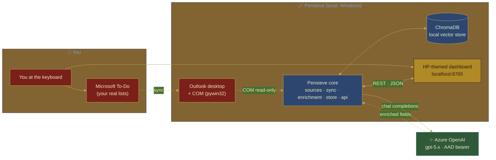
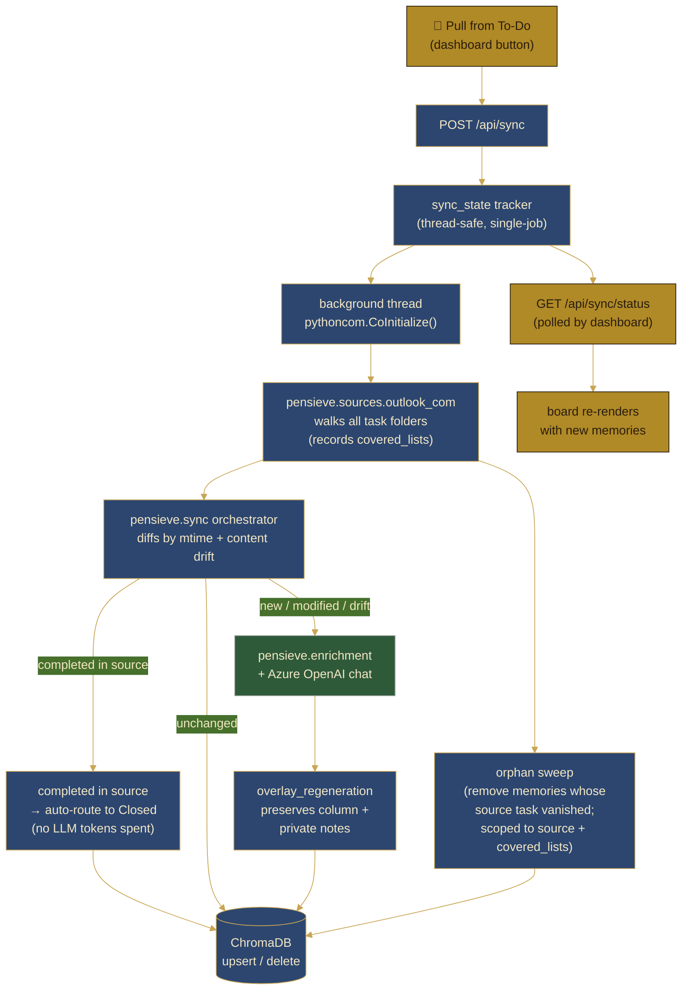
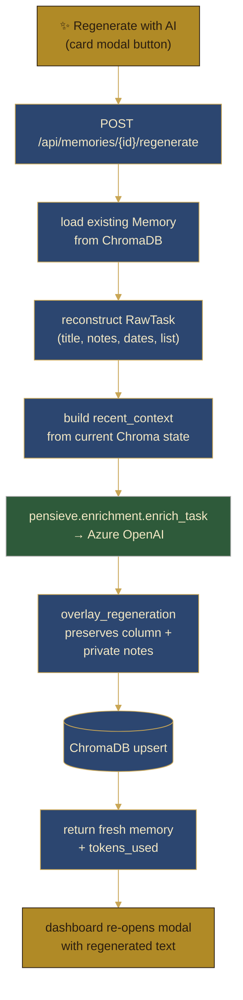

# Pensieve

> *Stir the surface and look within.*

Pensieve is a local, single-user productivity tool that pulls your Microsoft To-Do tasks, enriches each one with an LLM, stores them in a local vector database, and lays them out on a Harry Potter-themed kanban dashboard organized around your annual goals.

It runs entirely on your machine. Your To-Do data is read-only. Your enrichments live in a local ChromaDB. The dashboard is a static page served from a local FastAPI server.

> 🚀 **New here? See [SETUP.md](SETUP.md) for a 10-minute install + first-sync walkthrough.**

---

## Table of contents

1. [Why this exists](#why-this-exists)
2. [What it does](#what-it-does)
3. [Core concepts](#core-concepts)
4. [Connect Goals and the Houses](#connect-goals-and-the-houses)
5. [Phased roadmap](#phased-roadmap)
6. [Architecture](#architecture)
7. [Quickstart](#quickstart)
8. [The dashboard](#the-dashboard)
9. [Configuration](#configuration)
10. [Repository layout](#repository-layout)
11. [Hard constraints](#hard-constraints)
12. [Current status](#current-status)
13. [Design notes](#design-notes)
14. [License and acknowledgements](#license-and-acknowledgements)

---

## Why this exists

Microsoft To-Do is good at capturing tasks. It is not good at telling you:

- which of those tasks actually move the needle on your annual goals
- which ones share a thread (the same strand of work) and could be batched
- which ones are low-impact admin you should just power through
- what the past six weeks of your work has actually been about
- which finished tasks deserve to be remembered as evidence of impact

Pensieve sits next to To-Do, reads your tasks, and answers those questions. It does not change your To-Do. It enriches a parallel local store you can explore, search, and reflect against.

The mental model is from the books: a Pensieve is a basin where you store and revisit memories. Captured tasks become Memories. Memories you take depth on become Dives. Work that needs another look gets pulled into Review. Closed work that taught you something is kept as evidence (Phase 3 will distill it into "Vials" for performance reviews).

## What it does

In its current state, Pensieve:

- **Pulls** every task from your default Outlook tasks folder (To-Do tasks are Outlook tasks under the hood), read-only, via local COM interop on Windows. No Microsoft Graph, no Entra app, no admin consent.
- **Enriches** each task with an Azure OpenAI call that asks: which Strand is this part of, what is its real why and impact, which of your annual Connect Goals does it serve, and how confident are we about each of those?
- **Stores** the enriched result in a local ChromaDB. Each task gets an embedding so you can semantically search the whole corpus.
- **Serves** a local FastAPI on `http://localhost:8765` that exposes the enrichments and powers the dashboard.
- **Renders** a Harry Potter-themed kanban dashboard with two views (Lifecycle and Houses), three themes (day, night, marauder), a drag-and-drop column model, semantic search, and an in-app editor for your Connect Goals.

What it deliberately does **not** do (yet):

- Write anything back to To-Do (no Notes patching, no category writes, nothing)
- Touch your calendar, mail, Teams, or any other Microsoft Graph surface
- Run anywhere except your machine
- Require any custom Entra app registration

## Core concepts

| Concept | What it is | Where it lives |
| ------- | ---------- | -------------- |
| **Task** | A row from Microsoft To-Do (Outlook task), pulled read-only | Outlook, mirrored into Pensieve only as input |
| **Strand** | A named recurring thread of work (DORA RFI Responses, NIS2 Crosswalk, 1:1 Prep, etc.). Each Strand has a `kind` (deep, tactical, learning, writing) and may map to one or more Connect Goals. | `data/samples.json` `strand_catalog` (you maintain it) |
| **Memory** | An enriched task. Has a Strand assignment, a `why`, an `impact`, confidence scores, and one or more Connect Goal alignments. Stored as a row in ChromaDB with title-and-body embeddings. | `data/chroma/` |
| **Lifecycle column** | Where a Memory sits in your workflow: Memory → Dive → Review → Closed. You drag cards between columns; your placement survives re-syncs. | Dashboard state, persisted via API |
| **Dive** | A Memory you decided to take depth on this week |
| **Review** | A Memory you want a second look at — manually flagged for follow-up (this is user-driven; the "needs review" badge that the LLM raises is independent and can appear in any column) |
| **Closed** | A Memory that is done. Tasks completed in To-Do auto-route here on the next sync. |
| **Connect Goal** | One of your annual top-level goals. Pensieve maps each Memory to zero, one, or several. Count is up to you — import your Connect PDF and any number of goals works. | `data/connect-goals.json` |
| **House** | A Hogwarts house each Connect Goal is mapped to (purely a visual identity for the Houses view). 8 House slots available (4 canonical + Internal / Muggleborn / Centaur / Phoenix); goals beyond 8 cycle. | Set inside each goal's record |

Future-stage concepts still in the codebase but not exposed as columns today:

- **Reverie** — a scheduled focus block (Phase 2.5). The proposal and debrief prompts are pre-staged in `prompts/`; calendar integration is deferred.
- **Vial** — a single closed task's distilled impact statement, exported to Synapse Promo Coach (Phase 3). The Pydantic model exists; the export pipeline does not yet.

## Connect Goals and the Houses

Connect Goals are the annual top-level goals you set with your manager (the Microsoft Connect process is the inspiration; the concept works with any annual goal framework — OKRs, V2MOM, MBOs).

Pensieve treats them as first-class. Every Memory gets aligned (or explicitly not aligned) to one or more Connect Goals during enrichment, with a confidence score and a short alignment note explaining the reasoning.

The dashboard supports two views:

- **Lifecycle view**: 4 columns (Memory → Dive → Review → Closed), the classic kanban
- **Houses view**: one column per Connect Goal, themed as a Hogwarts house, plus an "Unhoused" column for work that doesn't directly map to any annual goal. Columns auto-fit, so any number of goals lays out cleanly.

You can populate your goals in three ways:

1. **Upload your Connect PDF** (recommended). Click **Set Goals** in the dashboard, choose your Connect PDF, click ✨ Parse with AI. The backend extracts each goal and deterministically assigns a House from an 8-entry palette.
2. **Hand-edit** them with the in-modal editor (+ Add goal / × delete on each card).
3. **Edit `data/connect-goals.json`** directly if you prefer your text editor.

All three paths persist to the same file via `POST /api/goals`. The dashboard hydrates from `GET /api/goals` on load.

The 8 House slots are intentional but cosmetic:

| House | Best fit for goals that are |
| ----- | --------------------------- |
| Gryffindor (scarlet and gold) | Front-line, high-visibility, courage-required work |
| Hufflepuff (yellow and black) | Sustained, year-over-year, dependable delivery |
| Slytherin (green and silver) | Long-game strategic foundation, careful positioning |
| Ravenclaw (blue and bronze) | Innovation, learning, intellectual depth |
| Internal (slate and gold) | Internal-team-facing operational work |
| Muggleborn (terracotta and parchment) | Cross-organization muggle-side coordination |
| Centaur (forest and gold) | Long-arc strategic foresight and judgment work |
| Phoenix (ember and saffron) | High-stakes recovery or transformation work |

Goals beyond eight cycle through the palette again. You can rename or recolor any House in `pensieve/enrichment/goals_importer.py::HOUSE_PALETTE` and the mirror in `frontend-proto/pensieve.js`.

## Phased roadmap

Pensieve is built in deliberate phases. Each phase has a clear ship gate and is meant to be useful on its own.

**Phase 0 — Sample-driven enrichment** *(complete)*
Read tasks from a canned `samples.json`, run them through the enrichment prompt, prove the prompt does sensible work. PowerShell, no Chroma, no API.

**Phase 1 — Local stack with ChromaDB and live To-Do** *(current)*
Read live To-Do tasks via Outlook COM (read-only), enrich them, persist to local ChromaDB, serve via FastAPI, render on the dashboard. No writeback, no calendar, no Graph.

**Phase 2 — Closure capture and Vials**
When you complete a task in To-Do, Pensieve detects it on the next sync, prompts you for an impact statement, and stores a Vial in Chroma. The Vial is searchable evidence of finished work for self-assessments and reviews.

**Phase 3 — Reflection and Reverie debrief**
Weekly and monthly reflection prompts. Closing-of-Reverie debrief flow. Reflection turns into structured notes you can paste into a manager update or a self-assessment without losing the original framing.

**Phase 4 — Calendar integration**
Pensieve proposes focus blocks for Reverie based on your stated weekly deep-work budget, then writes them to your calendar after you approve. This phase is deferred until corporate calendar integration paths under SFI are clearer.

**Phase 5 — Cross-source sync**
Pull tasks from multiple sources at once (To-Do, GitHub issues you own, action items extracted from meeting notes, etc.). Same Chroma, same dashboard, same Connect Goal alignment.

**Phase 6 — Multi-machine sync**
A small sync layer so your Chroma store is consistent across machines without losing the "local first, no cloud needed" property.

## Architecture

Pensieve's architecture is presented in three layered diagrams — a high-level **Context** view, plus two **Flow** views for the two main workflows. Each is small enough to fit in any LLM's output cap (under ~1,500 chars) and renders natively on GitHub.

### 1 / Context — what talks to what



**Read it as:** you live in two places (Microsoft To-Do for capturing, the Pensieve dashboard for thinking). Pensieve only reads from To-Do (via Outlook COM), enriches with Azure OpenAI, and persists everything in a local ChromaDB. The dashboard never writes to To-Do.

### 2 / Sync flow — 🦉 Pull from To-Do



**Key invariants on this path:**

- **Outlook is read-only.** No `.Save()` anywhere; a unit test asserts forbidden mutation method names don't exist on any source class.
- **One sync at a time.** The tracker refuses a second sync while one is running — ChromaDB is a single-writer store and concurrent writers would corrupt the index.
- **Three diff branches, not two.** A task that's been *completed* in To-Do skips the LLM entirely and auto-routes to **Closed** (saves tokens; closure is signal-free). Tasks that are *new, modified, or have content drift* (title/notes changed even without an `mtime` bump) go through enrichment. *Unchanged* tasks pass straight through to an idempotent upsert.
- **`overlay_regeneration` is what makes the workflow "edit title in To-Do → click 🦉" safe.** Your lifecycle column placement and private notes survive the re-enrichment.
- **Orphan sweep is scoped, not global.** A narrow sync (e.g. only the "Agentic AI work" list) can only delete memories from lists *that sync was actually responsible for observing*. This is mandatory — a naive "delete anything not in the live pull" would erase every memory from every other list.

### 3 / Regenerate flow — ✨ Regenerate with AI (per card)



**What gets regenerated:** title (refreshed from source), `why`, `impact`, `suggested_strand`, `strand_kind`, confidences, `connect_goal_ids`, `connect_alignment_note`, `needs_human_strand_review`. **What's preserved:** `column` (where you dragged the card) and `notes_for_user` (your private note).

### Why three diagrams instead of one

A single big architecture diagram hits two walls fast: **LLM output token limits** when generating (most models cap output at 4–8k tokens), and **human readability** when reading (past ~25 nodes, layouts become a hairball regardless of tool). The C4 model's insight applies: zoom in deliberately. Pensieve's three layers — Context (what), Sync (how new tasks arrive), Regenerate (how cards get re-enriched) — each tell one story.

If Pensieve grows enough to outgrow Mermaid, the next stop is **[D2](https://d2lang.com/)** (~half the tokens per node, much better layout engine) or **[Structurizr DSL](https://structurizr.com/)** (write the system once, auto-derive Context/Container/Component diagrams).

### Prompts used to generate these diagrams

To regenerate as Pensieve evolves, feed any LLM one of these targeted prompts (each fits comfortably in a single response):

<details>
<summary><b>Context diagram prompt</b></summary>

> Generate a Mermaid `flowchart LR` **context diagram** for **Pensieve**: a Harry Potter–themed personal kanban + AI enrichment layer over Microsoft To-Do, read via local Outlook COM (pywin32). Show three subgraphs: "🧙 You" (the user + Microsoft To-Do), "🪄 Pensieve (local, Windows)" (Outlook desktop + COM, Pensieve core, local ChromaDB, HP-themed dashboard on localhost:8765), and a single "✨ Azure OpenAI gpt-5.x" node outside both. Solid arrows for runtime flow, dashed arrows for read-only / async / config flow. The dashboard never writes to To-Do (no arrow that direction). Apply HP house `classDef`s: Gryffindor red/gold for user/source-of-truth, Ravenclaw blue/bronze for Pensieve core + storage, Hufflepuff yellow/black for the dashboard, Slytherin green/silver for Azure OpenAI. Use Mermaid theme `base` with the gold/navy variable overrides.

</details>

<details>
<summary><b>Sync flow prompt</b></summary>

> Generate a Mermaid `flowchart TD` **sync-flow diagram** for **Pensieve**'s 🦉 "Pull from To-Do" button. Trace: button click → `POST /api/sync` → thread-safe `sync_state` tracker → background thread (calls `pythoncom.CoInitialize()`) → `pensieve.sources.outlook_com` walks all task folders and records which lists were covered → `pensieve.sync` orchestrator diffs by both `last_modification_time` and **content drift** (title/notes changes that didn't bump mtime). Branch into THREE paths: (1) tasks **completed** in source → auto-route to the **Closed** column with no LLM call, (2) **new / modified / drift** → Azure OpenAI enrichment → `overlay_regeneration` (preserves user column + private notes), (3) **unchanged** → idempotent upsert. Also show a separate **orphan sweep** branch off the source: memories whose source task vanished get deleted from Chroma, *scoped to `source + covered_lists` only* (so a narrow sync can never erase memories from lists it didn't pull). All three branches and the sweep terminate at ChromaDB upsert/delete. Separately show the polling loop: dashboard polls `GET /api/sync/status` → re-renders the board. Hufflepuff colors for UI nodes, Ravenclaw for backend, Slytherin for the LLM.

</details>

<details>
<summary><b>Regenerate flow prompt</b></summary>

> Generate a Mermaid `flowchart TD` **per-card regenerate-flow diagram** for **Pensieve**'s ✨ "Regenerate with AI" button. Trace: button in card modal → `POST /api/memories/{id}/regenerate` → load existing Memory from ChromaDB → reconstruct a `RawTask` from the persisted fields → build `recent_context` from current Chroma state → `enrich_task` calls Azure OpenAI → `overlay_regeneration` merges fresh enrichment onto existing Memory (preserves column + private notes) → upsert → return JSON with new memory + tokens_used → dashboard re-opens the modal with regenerated text. Hufflepuff for UI, Ravenclaw for backend, Slytherin for the LLM.

</details>


## Quickstart

Prerequisites:

- Windows 10 or 11
- Microsoft Outlook desktop installed and signed in to your work account
- Python 3.11 or newer
- `az login` working with your work account (for Azure OpenAI bearer token auth) OR an Azure OpenAI API key in `.env`

```powershell
# 1. Clone and enter the repo
git clone https://github.com/andy-herman/pensieve
cd pensieve

# 2. Set up the virtualenv and install
python -m venv .venv
.\.venv\Scripts\Activate.ps1
pip install -e .

# 3. Configure
Copy-Item .env.example .env
notepad .env   # edit AZURE_OPENAI_ENDPOINT etc.

# 4. Verify everything resolves
pensieve init

# 5. Try a dry run against the canned samples (no LLM calls)
pensieve sync --source sample_file --dry-run

# 6. Run it for real against samples (proves your LLM connection works)
pensieve sync --source sample_file

# 7. Inspect Chroma
pensieve status
pensieve search "deadline this week"

# 8. Start the API and dashboard
pensieve serve
# Open http://localhost:8765/ in your browser
```

> 💡 **Tired of starting the server manually?** Run `tools\Install-PensieveAutoStart.ps1`
> once and the backend will launch (minimized) every time you log in to Windows.
> See [tools/README.md](tools/README.md). Uninstall anytime with `Uninstall-PensieveAutoStart.ps1`.

Once that round-trip is working, switch to live To-Do tasks:

```powershell
# Pull live tasks from your running Outlook client (read-only)
pensieve sync --source outlook_com

# Re-enrich every task even if unchanged
pensieve sync --source outlook_com --force

# Pull from a non-default tasks folder
pensieve sync --source outlook_com --list "CISO GRC"
```

You can also set `PENSIEVE_DEFAULT_SOURCE=outlook_com` in `.env` so `pensieve sync` defaults to live data.

## The dashboard

The dashboard is a single static page served by the FastAPI app at the root URL. It has no build step, no framework, no transpilation. It is plain HTML, CSS, and JavaScript so you can read every line.

Features:

- **Lifecycle view** with 4 columns (Memory, Dive, Review, Closed). Drag cards between columns; the change persists to Chroma via PATCH. Tasks completed in To-Do auto-route to Closed on the next sync (no LLM tokens spent).
- **Houses view** with one column per Connect Goal plus an Unhoused column. Columns auto-fit, so any number of goals lays out cleanly. Drag a card to a House to mark that Memory as aligned to that goal.
- **Three themes**:
  - *Day*: parchment and ink, sunlit
  - *Night*: candle-lit, deep blues, gentle star field
  - *Marauder*: revealed by typing "i solemnly swear that i am up to no good" with the page focused (revert with "mischief managed")
- **Text filter**: type in the search box to filter by title, why, or impact across the loaded memories.
- **Semantic search**: press Enter in the search box (or click the magnifier) to query Chroma. The board filters to the semantic top-K.
- **Hedwig review counter**: top-right, shows how many memories are currently in the review queue (low confidence or explicitly flagged by the LLM).
- **Footprint trail**: while dragging a card, faint footprints follow your cursor and fade out.
- **Goals editor**: the **Set Goals** button opens a modal where you can upload your Connect PDF for AI parsing (✨ Parse with AI), or hand-edit/add/remove goals. Saves to `data/connect-goals.json` via the API.

The dashboard remains functional without the API server: if `/api/healthz` is unreachable, it falls back to the bundled seed memories and shows "offline (seed data)" in the footer.

## Configuration

All config flows through `.env`. The most important keys:

| Variable | Default | What it does |
| -------- | ------- | ------------ |
| `AZURE_OPENAI_ENDPOINT` | (required) | Your Azure OpenAI resource URL |
| `AZURE_OPENAI_DEPLOYMENT` | `gpt-5.4-2` | Deployment name to call |
| `AZURE_OPENAI_API_VERSION` | `2024-12-01-preview` | API version |
| `AZURE_OPENAI_API_KEY` | (unset) | Optional override; if unset, uses `DefaultAzureCredential` |
| `PENSIEVE_DEFAULT_SOURCE` | `sample_file` | `sample_file` or `outlook_com` |
| `PENSIEVE_BACKEND_PORT` | `8765` | Port the FastAPI binds to |
| `PENSIEVE_DATA_DIR` | `./data` | Where Chroma, samples, goals, and the audit log live |
| `PENSIEVE_ENRICHMENT_CONFIDENCE_THRESHOLD` | `0.6` | Below this, a memory is flagged for review |
| `PENSIEVE_ENRICHMENT_MAX_TOKENS` | `1500` | Per-enrichment cap |
| `PENSIEVE_ENRICHMENT_CONCURRENCY` | `3` | How many tasks to enrich in parallel |
| `PENSIEVE_OUTLOOK_SKIP_COMPLETED_OLDER_DAYS` | `30` | Don't bother enriching completed tasks older than this |
| `PENSIEVE_API_CORS_ORIGINS` | `http://localhost:8765,http://127.0.0.1:8765,null` | Comma-separated CORS allow-list |

See `.env.example` for the canonical list.

## Repository layout

```
pensieve/
|-- pensieve/                  Python package (sources, enrichment, store, api, cli)
|   |-- sources/               Read-only task source adapters
|   |   |-- base.py            TaskSource ABC + RawTask model
|   |   |-- sample_file.py     Reads data/samples.json
|   |   |-- outlook_com.py     Reads live Outlook desktop via COM (no writes)
|   |-- enrichment/            LLM enrichment pipeline
|   |   |-- llm_client.py      Azure OpenAI chat-completions client
|   |   |-- prompt.py          Loads the v2 enrichment prompt
|   |   |-- connect_goals.py   Loads data/connect-goals.json
|   |   |-- enricher.py        Per-task enrichment with structured JSON output
|   |-- store/                 ChromaDB-backed memory store
|   |   |-- chroma.py          PersistentClient wrapper (upsert, get, search)
|   |   |-- schema.py          Memory + Vial pydantic models
|   |-- api/                   FastAPI server
|   |   |-- server.py          Routes + static mount for the dashboard
|   |-- cli.py                 Typer CLI: init, sync, status, search, serve, goals
|   |-- config.py              pydantic-settings, .env loader
|   |-- sync.py                Sync orchestrator: pull -> enrich -> upsert
|
|-- frontend-proto/            Local-first HP-themed kanban dashboard (HTML/CSS/JS)
|   |-- index.html
|   |-- pensieve.css
|   |-- pensieve.js
|
|-- prompts/                   Enrichment + reverie prompts (markdown)
|   |-- enrich-memory-prompt.md
|   |-- reverie-proposal-prompt.md
|   |-- reverie-debrief-prompt.md
|
|-- scripts/                   Legacy PowerShell Phase 0 entry points (kept for now)
|   |-- Enrich-Memories.ps1
|   |-- Test-AzureOpenAI.ps1
|   |-- lib/Invoke-AzureOpenAI.ps1
|   |-- lib/Load-DotEnv.ps1
|
|-- data/                      Local store (gitignored where appropriate)
|   |-- samples.json           Strand catalog + sample tasks (also used in tests)
|   |-- connect-goals.json     Your Connect goals (any count; populated by PDF import or by hand)
|   |-- chroma/                ChromaDB persistent store (gitignored)
|   |-- audit-log.jsonl        Append-only log of every sync action (gitignored)
|
|-- tests/                     pytest suite (sources, store, enrichment shape)
|
|-- pyproject.toml             Package metadata + dependencies
|-- .env.example               Documented config template
|-- AGENTS.md                  Instructions for AI assistants working in this repo
|-- SPEC.md                    Long-form design spec
|-- PHASES.md                  Phased roadmap with ship gates
|-- OPEN-QUESTIONS.md          Live open questions and how they were answered
|-- README.md                  This file
```

## Hard constraints

These are non-negotiable for the foreseeable future:

1. **Read-only against To-Do.** No writes to task notes, no changes to categories, no completion toggling, no deletes. The pull-only contract is the safety property that makes Pensieve trustworthy.
2. **No Microsoft Graph in the runtime.** No Entra app registration required. No corporate admin consent needed.
3. **Local only.** No cloud hosting, no remote storage, no telemetry. ChromaDB telemetry is explicitly disabled.
4. **Single user.** No multi-tenancy, no auth beyond the localhost bind.
5. **Plain dashboard.** The frontend has no build step. You can open it in a browser, view source, and read every line.
6. **Honest confidence.** Every enrichment carries strand, impact, and Connect-alignment confidence scores. The LLM is instructed to be conservative; below-threshold outputs land in the review queue rather than being shown as ground truth.

## Current status

Phase 1 is complete enough to use day to day for a single user. Phase 2 (closure detection and Vials) and Phase 4 (calendar integration) are the next big rocks. Phase 4 is parked on the Microsoft Secure Future Initiative timeline rather than on Pensieve's design — see `OPEN-QUESTIONS.md` for the current state of that conversation.

## Design notes

A few opinionated choices worth calling out:

- **The source ID is the Chroma ID.** When a task comes from Outlook, the Outlook `EntryID` becomes the Chroma document ID. This makes idempotency trivial: re-syncing the same task upserts in place; the only way to get a duplicate is to break that contract.
- **Embedding text combines title, why, impact, alignment note, and original notes.** Searching for a regulator name or a project codename hits all of those layers, not just the title.
- **Strand catalog is human-maintained.** Pensieve does not invent Strands. You write them down in `samples.json` and the LLM picks among them. If nothing fits, the enrichment is flagged for review rather than guessed.
- **Connect Goal alignment is multi-label.** A cross-cutting task can be aligned to two or three goals at once. The prompt is explicit that operational and personal tasks should produce an empty alignment array rather than a stretched one.
- **The dashboard never breaks if the API is down.** It falls back to bundled seed memories and tells you in the footer. This is intentional so you can read the dashboard structure without running anything.
- **Audit log is append-only and gitignored.** Every sync action records mode, task ID, source, token cost, and result. The dashboard does not consume it; it's there for you to grep when something looks wrong.

## License and acknowledgements

MIT.

The Harry Potter visual language (Hogwarts houses, Marauder's Map vibes, the Pensieve metaphor) is used affectionately for personal-productivity styling and is not affiliated with or endorsed by Warner Bros. or J. K. Rowling. The houses are simple color palettes and labels in this codebase; no copyrighted assets are included.

The architectural pattern (pull-only source, local ChromaDB, FastAPI shell, static HP dashboard) is original to this project but obviously stands on the shoulders of Microsoft Graph, ChromaDB, FastAPI, Azure OpenAI, and Microsoft To-Do/Outlook teams whose tools make the whole thing possible.
